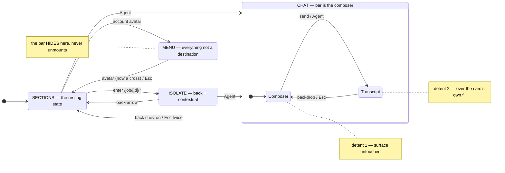
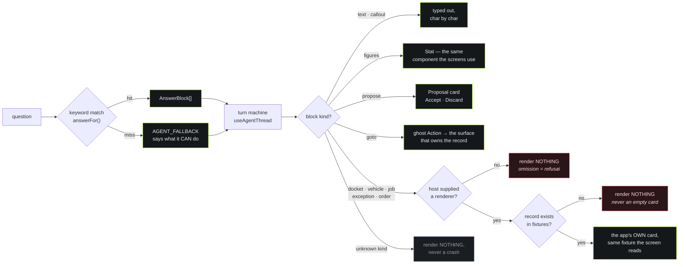
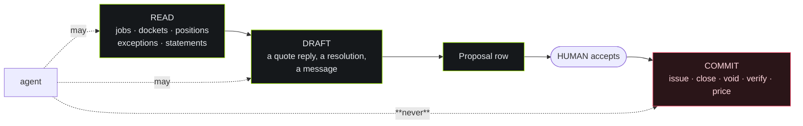
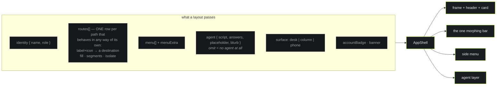

# Flows

**Last verified:** 2026-08-02. Diagrams render on GitHub and in most editors.

Three maps: what the shell DOES (state), where you can GO (navigation), and how
an agent answer is BUILT (pipeline). Everything here is front end on fixtures.

---

## 1 · The shell, as a state machine

One component drives every surface. These are all the states it has.

**The bar is one instance across all three modes.** It width-animates between
them, which is why Send lands where the Agent button was — that button is not
replaced, it *becomes* Send.

---

## 2 · Where you can go

**WHERE · WHAT · OWED** — one grammar across every surface that runs a business,
with the agent on the far side of a hairline. Everything cut from a bar went into
a **segment** or the **side menu**; nothing was deleted.

```mermaid
flowchart TD
    classDef bar fill:#1a1d21,stroke:#9AE600,color:#e7eaee
    classDef seg fill:#15181b,stroke:#3a3f45,color:#9aa0a6
    classDef menu fill:#15181b,stroke:#3a3f45,color:#9aa0a6,stroke-dasharray: 3 3
    classDef layer fill:#1a1d21,stroke:#E8A33D,color:#e7eaee

    subgraph COORD["apps/ops · coordinator"]
        direction TB
        CB["`**BAR** Map · Work · Money ┊ Agent`"]:::bar
        CB --> MAP["/map — fill, no scroll"]:::seg
        CB --> WORK["/work"]:::seg
        CB --> MONEY["/money"]:::seg
        CB -.-> CAG["Agent layer"]:::layer

        WORK --> W1["requests"]:::seg
        WORK --> W2["jobs → jobs/new · jobs/[id]"]:::seg
        WORK --> W3["dockets"]:::seg
        WORK --> W4["exceptions"]:::seg
        MONEY --> M1["statements"]:::seg
        MONEY --> M2["buyers"]:::seg

        CB -. avatar .-> CM["side menu:<br/>admin ×6 · sandbox"]:::menu
    end

    subgraph HAUL["apps/ops · hauler"]
        direction TB
        HB["`**BAR** Map · Work · Money ┊ Agent`"]:::bar
        HB --> HMAP["/hauler/map — its OWN trucks"]:::seg
        HB --> HW["/hauler/work"]:::seg
        HB --> HMON["/hauler/money"]:::seg
        HW --> HW1["available"]:::seg
        HW --> HW2["my dockets"]:::seg
        HB -.-> HM["side menu: my vehicles"]:::menu
        HB -.-> HAG["Agent layer"]:::layer
    end

    subgraph WORK2["apps/ops · worker — tap size"]
        WB["`**BAR** Today · Summary ┊ Agent`"]:::bar
        WB --> JOB["/job/[id]/pit → transit → dump"]:::seg
        JOB -. bar goes ISOLATE .-> WB
        WB -.-> WM["side menu:<br/>prototype conditions"]:::menu
        WB -.-> WAG["Agent layer"]:::layer
    end

    subgraph OPR["apps/ops · Gaia operator"]
        OB["`**BAR** Vendors · Credentials`"]:::bar
        OB -.-> ONO["NO agent — rule 6"]:::menu
    end

    subgraph BUY["apps/buyer · contractor"]
        direction TB
        BB["`**BAR** Map · Orders · Money ┊ Agent`"]:::bar
        BB --> BMAP["/map — where it is. NO ETA"]:::seg
        BB --> O1["/orders → orders/[id]"]:::seg
        BB --> O3["/money"]:::seg
        O1 -. primary action .-> ONEW["/order/new"]:::seg
        BB -.-> BM["side menu:<br/>sites · people · sign out"]:::menu
        BB -.-> BAG["Agent layer"]:::layer
    end

    PUB["`**(public)** — NO chrome at all
    /o/[token] · /login`"]:::menu
```

`/work` and `/money` are sections, not screens — each redirects to its first
segment. A section with segments has no page of its own.

**Nesting costs no taps after the first.** A section remembers the segment you
were last on, so Map → Work → Dockets is one tap on every return, not two
forever. Re-tapping the section you are already on resets it to the default.

**"Order material" is not in the bar.** A creation flow is not a place; it is
the `primary` action on the Orders screen.

---

## 3 · How an agent answer is built

The contract is `@syvon/mdx-chat`'s, with the compiler stubbed. What is real:
the block contract, the allowlist, and the graceful degradation.

### The three gates, and why each exists

| gate | failure it prevents |
|---|---|
| **omitted renderer** | the buyer app supplies `order` and nothing else, so an answer naming a vehicle drops rather than leaking the vendor's fleet into a contractor's app |
| **missing record** | an agent that can draw a docket-shaped box around a number it invented — the one failure an evidence product cannot have |
| **unknown kind** | one unhandled block taking the whole surface down; LLM output is untrusted |

### The commit line

The agent's output is a row a person accepts. There is no code path where a
model's confidence becomes a docket — and the scripted **refusal** exchange
("close docket 4517") is what keeps that demonstrated rather than asserted.

---

## 4 · What the shell is driven by

The whole of a surface is one call. Everything below is DATA, so adding a role
is a table, not a layout.

`surface` is ONE axis on purpose. It was two — a frame width and a control size
— and they were never set independently: `width="phone" size="lg"` was
expressible and meaningless, `width="desk" size="tap"` was expressible and
wrong. Two props that must agree are one prop with a bug waiting in it.

`routes` is ONE table for the same reason. It was three props — `sections`,
`segments`, `fillPaths` — plus a standalone `isolate` matcher, all answering
"what is special about this path" in four shapes, with one route's answers spread
across all of them. A row with no `label` is not a destination at all, which is
exactly what the worker's `/job` is: invisible in the bar, but entering it morphs
the bar to a back arrow.

### Still worth merging

| | today | why it could be one thing |
|---|---|---|
| `nav.ts` · `answers.tsx` · `AGENT_COPY` | three files per app | one `surface.tsx` per app exporting the finished config would put "what this role is" in one place instead of three. |
| `Proposal` | private to `chat.tsx` | the sandbox scene re-implements its markup to show a specimen. Exporting it deletes that copy. |
